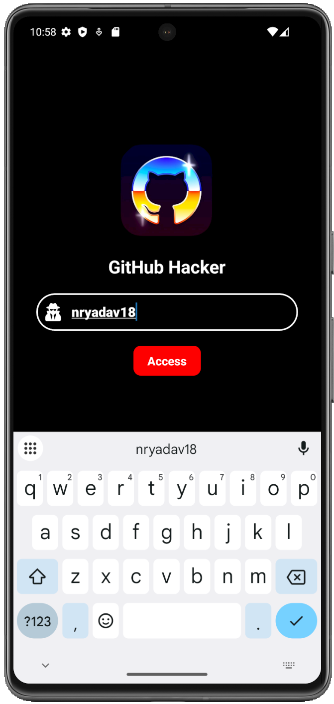
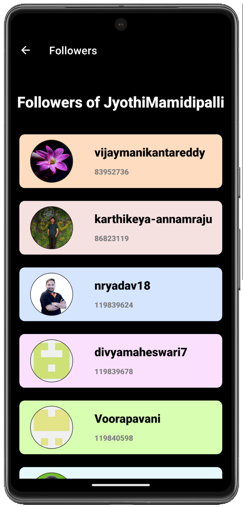

<h1 align="center" style="font-size:40px;"> Gitty — Personalised GitHub Application</h1> 
<h3 align="center">Repositories | Followings | Followers | Profiles — All at same place</h3>

---

Gitty App is a powerful Mobile Application built using REACT NATIVE designed to simplify the way users interact with GitHub profiles. It utilizes the GitHub API to provide detailed insights into any Public profile, including Repositories, Followers, and Following lists. You can also view the Profiles of Followers and Followings of any account too.

📱 Designed for mobile. 

---

## 🎬 App Demo

[🔗 Click Here To Download App Video](https://raw.githubusercontent.com/nryadav18/Gitty/main/videos/Gitty_Video.mp4)

<p align="center">
  
  
  
</p>

<p align="center">
  
  
  
</p>

<p align="center">
  
  
  
</p>

---

## 🧰 Tech Stack

- React Native Expo SDK 52
- EAS Build system
- Official GitHub API
  
---

### Clone the repo
```bash
git clone https://github.com/nryadav18/gitty.git
cd gitty
```

### Installation
```bash
npm install
```
### Running the App
```bash
npx expo start 
```

